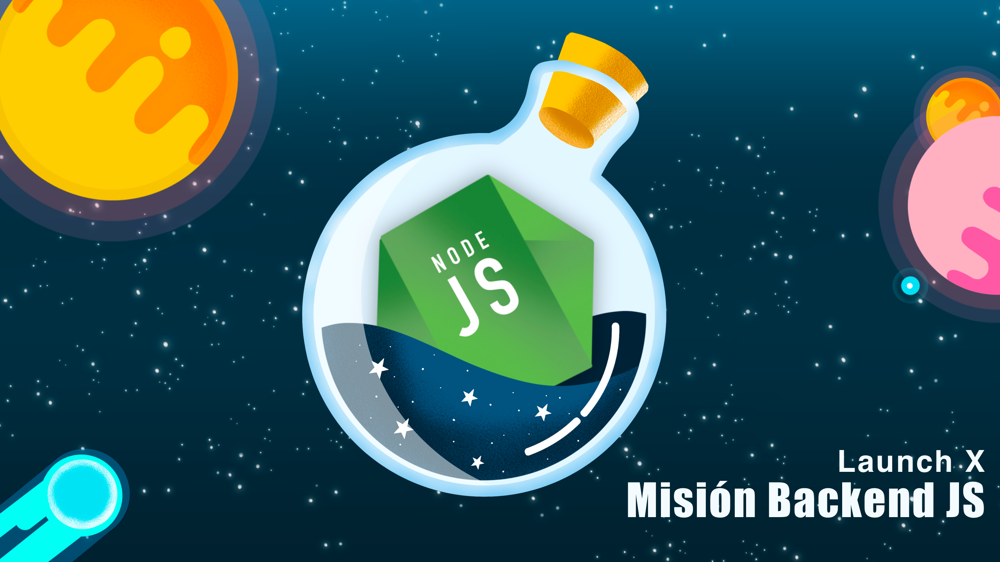

# Code-challenge: Diseño de API para Visual Thinking 💻

*Proyecto como parte modulo de desarrollo backend con Node y Express.*
 

## Index

* [Requerimientos](#1)
* [Diseño del proyecto](#diseño-del-proyecto)
* [Server API]()
* [Demo]()
* [Dependencias]()
---

---
 ### <a id="1">Se solicitó desarrollar una API que cumpla con los tres siguientes requerimientos basados en datos de **Visual Partner-Ship*: </a>

* Habilitar un endpoint para consultar todos los estudiantes con todos sus campos.
* Habilitar un endpoint para consultar los emails de todos los estudiantes que tengan certificación haveCertification.
* Habilitar un endpoint para consultar todos los estudiantes que tengan creditos mayor a 500.

| Requerimiento     | Endpoint    | Request |
|-------------------|-------------|---------|
|Endpoint para consultar todos los estudiantes   con todos sus campos| `/v1/students/`|x|
|Endpoint para consultar los emails de todos los   estudiantes que tengan certificación haveCertification| `/v1/students/haveCertification` |x|
|Endpoint para consultar todos los estudiantes   que tengan creditos mayor a 500|`/v1/students/:credits`|x|

### Diseño del proyecto:

