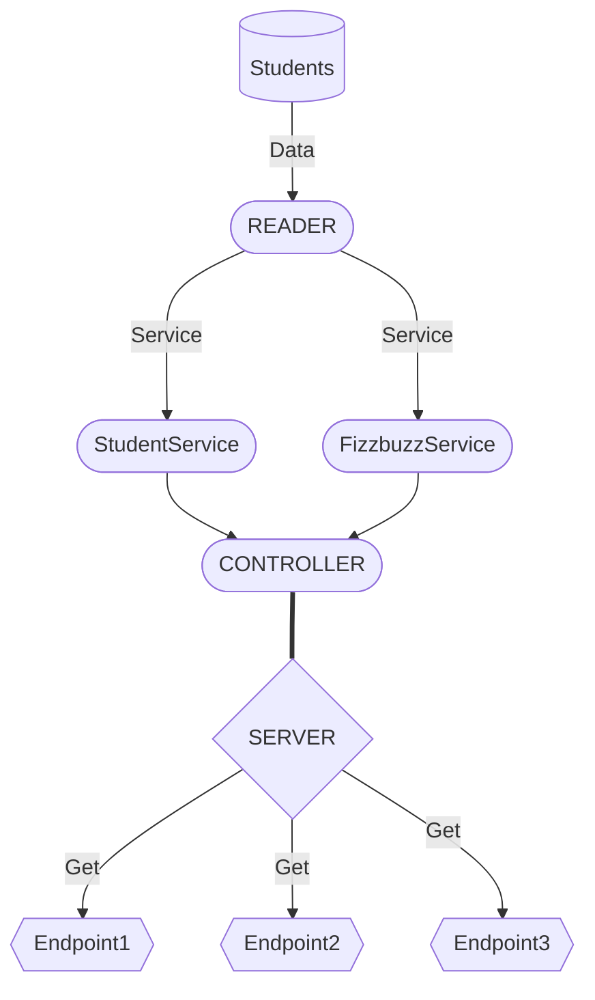

# Code-challenge: Diseño de API para Visual Thinking 💻

*Proyecto como parte modulo de desarrollo backend con Node y Express.*
<br>


## Index

* [Requerimientos](#1)
* [Diseño del proyecto](#diseño-del-proyecto)
* [Server API](#server-api)
* [Demo]()
* [Dependencias]()
---


---
 ## <a id="1">Se solicitó desarrollar una API que cumpla con los tres siguientes requerimientos basados en datos de *Visual Partner-Ship*: </a>

* Habilitar un endpoint para consultar todos los estudiantes con todos sus campos.
* Habilitar un endpoint para consultar los emails de todos los estudiantes que tengan certificación haveCertification.
* Habilitar un endpoint para consultar todos los estudiantes que tengan credits mayor a 500.

| Requerimiento     | Endpoint    | Ejemplo de Request |
|-------------------|-------------|---------|
|Consultar todos los estudiantes con todos sus campos| `/v1/students/`|`localhost:3000/v1/students`|
|Consultar los emails de todos los estudiantes que tengan certificación haveCertification| `/v1/students/haveCertification/`|`localhost:3000/v1/students/haveCertification`|
|Consultar todos los estudiantes que tengan creditos mayor a 500|`/v1/students/:credits`|`localhost:3000/v1/students/credits`|


### Diseño del proyecto:

El funcionamiento del proyecto se baso en el siguiente programa, teniendo así una estructura limpia en donde en el servidor solo se definen los endpoints y toda la logica se desarrolla en los services y el controlador.



Para la Estructura del proyecto se planeó como sigue:
```
.
├── lib
│   ├── assets
│   ├── controllers
│   ├── services
│   └── utils
└── test
    ├── controllers
    ├── data_test
    ├── services
    └── utils
```

## Server API
Se defidienron los siguientes endoints:
```JS
app.get("/", (req, res) => {
    res.status(200).json({ msj: "Hiii" });
});

app.get("/v1/students/", (req, res) => {
    const allStudents = VisualpartnerController.getAllVisualpartners();
    res.status(200).json(allStudents);
});

app.get("/v1/students/haveCertification", (req, res) => {
    const studentsWithCertification = VisualpartnerController.getStudentsWithCertification();
    res.status(200).json(studentsWithCertification);
});

app.get("/v1/students/credits", (req, res) => {
    const students = VisualpartnerController.getStudentsByCredits();
    res.status(200).json(students);
});
```


